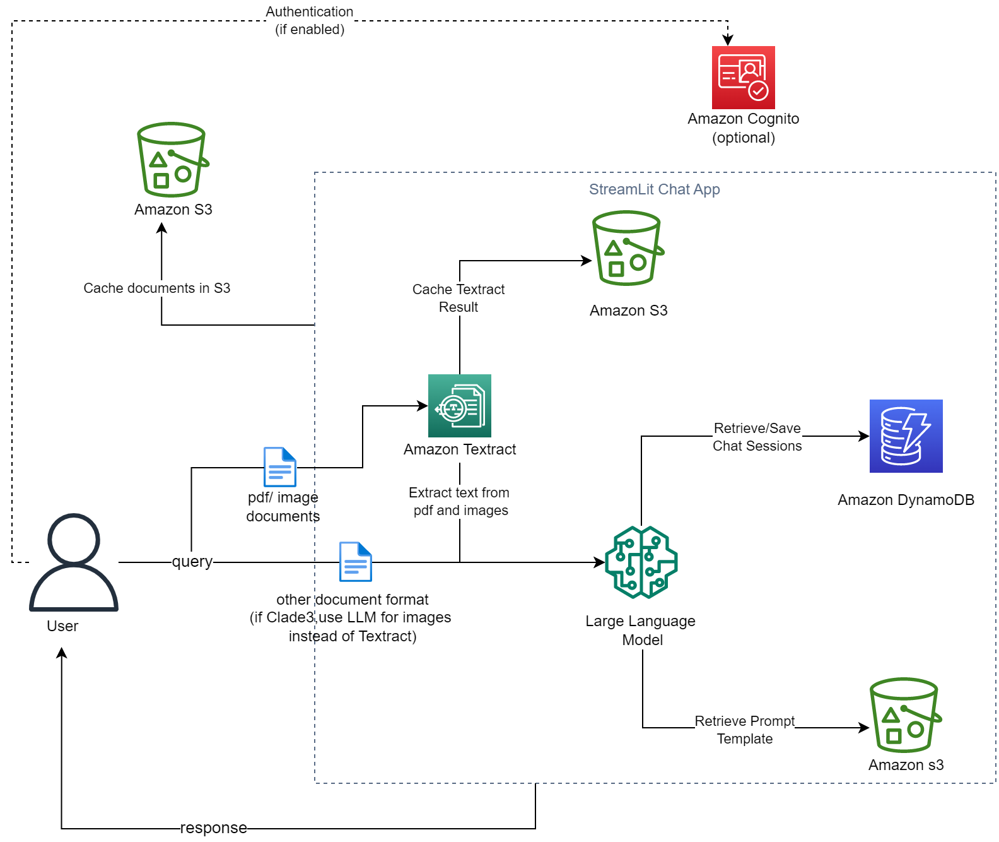
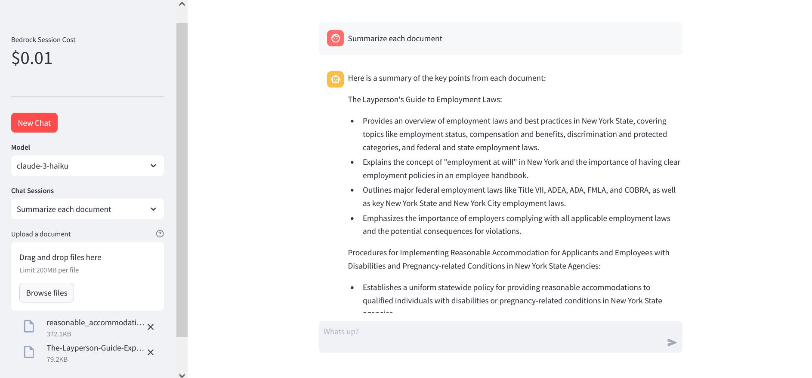

# Bedrock Claude ChatBot
Bedrock Chat App is a Streamlit application that allows users to interact with the Anthropic Bedrock language model. It provides a conversational interface where users can ask questions, upload documents, and receive responses from the AI assistant.

## Features

- **Conversational UI**: The app provides a chat-like interface for seamless interaction with the AI assistant.
- **Document Upload**: Users can upload various types of documents (PDF, CSV, TXT, PNG, JPG, XLSX, JSON, Python scripts) to provide context for the AI assistant.
- **Caching**: Uploaded documents and extracted text are cached in an S3 bucket for improved performance.
- **Chat History**: The app stores and retrieves chat history from a DynamoDB table, allowing users to continue conversations across sessions.
- **Model Selection**: Users can select different Anthropic models (Claude-3-Sonnet, Claude-3-Haiku, Claude-Instant-V1, Claude-V2, Claude-V2:1) for their queries.
- **Cost Tracking**: The application calculates and displays the cost associated with each chat session based on the input and output token counts and the pricing model defined in the `pricing.json` file.
- **Authentication (Optional)**: The app can be configured to use Amazon Cognito for user authentication.
- **Logging**: The items logged in the DynamoDB table include the user ID, session ID, messages, timestamps,uploaded documents s3 path, input and output token counts. This helps to isolate user engagement statistics and track the various items being logged, as well as attribute the cost per user.

There are two files of interest.
1. A Jupyter Notebook that walks you through the ChatBot Implementation.
2. A Streamlit app that can be deployed to create a UI Chatbot.

**Guidelines**
- When a document is uploaded (and for everytime it stays uploaded), its content is attached to the user's query, and the chatbot's responses are grounded in the document.
- If the document is detached, the chat history will only contain the user's queries and the chatbot's responses, unless the `load-doc-in-chat-history` configuration parameter is enabled, in which case the document content will be retained in the chat history.

## To run this Streamlit App on Sagemaker Studio follow the steps below:

* Set up the necessary AWS resources:
   - [Create an S3 bucket](https://docs.aws.amazon.com/AmazonS3/latest/userguide/create-bucket-overview.html) (if not already have one) to store uploaded documents and Textract output.
   - Create a DynamoDB table to store chat history (Run the notebook **BedrockChatUI** to deploy a DynamoDB Table).
   - [Configure Amazon Cognito for user authentication](https://docs.aws.amazon.com/cognito/latest/developerguide/cognito-user-pools-configuring-app-integration.html) (optional)). This implementation uses `USER_PASSWORD_AUTH` for authentication flow.

## Configuration
The application's behavior can be customized by modifying the `config.json` file. Here are the available options:

- `DynamodbTable`: The name of the DynamoDB table used for storing chat history.
- `UserId`: The default user ID for the application (used if authentication is disabled).
- `Bucket_Name`: The name of the S3 bucket used for caching documents and extracted text.
- `max-output-token`: The maximum number of output tokens allowed for the AI assistant's response.
- `cognito-app-id`: The ID of the Amazon Cognito app used for authentication (if enabled).
- `use-cognito`: A boolean flag indicating whether to use Amazon Cognito for authentication.
- `chat-history-loaded-length`: The number of recent chat messages to load from the DynamoDB table.
- `bedrock-region`: The AWS region where the Bedrock runtime is deployed.
- `load-doc-in-chat-history`: A boolean flag indicating whether to load documents in the chat history. If True all documents would be loaded in chat history (provides more chat context at the cost of price and latency). If False only the user query and response would be loaded in the chat history.

If You have a sagemaker Studio Domain already set up, ignore the first item, however, item 2 is required.
* [Set Up SageMaker Studio](https://docs.aws.amazon.com/sagemaker/latest/dg/onboard-quick-start.html) 
* SageMaker execution role should have access to interact with [Bedrock](https://docs.aws.amazon.com/bedrock/latest/userguide/api-setup.html), [Textract](https://docs.aws.amazon.com/aws-managed-policy/latest/reference/AmazonTextractFullAccess.html), [DynamoDB](https://docs.aws.amazon.com/amazondynamodb/latest/developerguide/iam-policy-specific-table-indexes.html), and [S3](https://docs.aws.amazon.com/AmazonS3/latest/userguide/access-policy-language-overview.html).
* [Launch SageMaker Studio](https://docs.aws.amazon.com/sagemaker/latest/dg/studio-launch.html)
* [Clone this git repo into studio](https://docs.aws.amazon.com/sagemaker/latest/dg/studio-tasks-git.html)
* Open a system terminal by clicking on **Amazon SageMaker Studio** and then **System Terminal** as shown in the diagram below
* 
* Navigate into the cloned repository directory using the `cd` command and run the command `pip install -r req.txt` to install the needed python libraries
* Run command `python3 -m streamlit run bedrock-chat.py --server.enableXsrfProtection false --server.enableCORS  false` to start the Streamlit server. Do not use the links generated by the command as they won't work in studio.
* To enter the Streamlit app, open and run the cell in the **StreamlitLink.ipynb** notebook. This will generate the appropiate link to enter your Streamlit app from SageMaker studio. Click on the link to enter your Streamlit app.
* **⚠ Note:**  If you rerun the Streamlit server it may use a different port. Take not of the port used (port number is the last 4 digit number after the last : (colon)) and modify the `port` variable in the `StreamlitLink.ipynb` notebook to get the correct link.

To run this Streamlit App on AWS EC2 (I tested this on the Ubuntu Image)
* [Create a new ec2 instance](https://docs.aws.amazon.com/AWSEC2/latest/UserGuide/EC2_GetStarted.html)
* Expose TCP port range 8500-8510 on Inbound connections of the attached Security group to the ec2 instance. TCP port 8501 is needed for Streamlit to work. See image below
* 
* [Connect to your ec2 instance](https://docs.aws.amazon.com/AWSEC2/latest/UserGuide/AccessingInstances.html)
* Run the appropiate commands to update the ec2 instance (`sudo apt update` and `sudo apt upgrade` -for Ubuntu)
* Clone this git repo `git clone [github_link]`
* Install python3 and pip if not already installed
* EC2 [instance profile role](https://docs.aws.amazon.com/IAM/latest/UserGuide/id_roles_use_switch-role-ec2_instance-profiles.html) has the required permissions to access the services used by this application mentioned above.
* Install the dependencies in the requirements.txt file by running the command `sudo pip install -r req.txt`
* Run command `tmux new -s mysession`. Then in the new session created `cd` into the **ChatBot** dir and run `python3 -m streamlit run bedrock-chat.py` to start the streamlit app. This allows you to run the Streamlit application in the background and keep it running even if you disconnect from the terminal session.
* Copy the **External URL** link generated and paste in a new browser tab.
To stop the `tmux` session, in your ec2 terminal Press `Ctrl+b`, then `d` to detach. to kill the session, run `tmux kill-session -t mysession`

## Limitations and Future Updates
1. **Limited Bedrock Model Selection**: The application currently supports a fixed set of Bedrock models, including "claude-3-sonnet", "claude-3-haiku", "claude-instant-v1", "claude-v2:1", and "claude-v2". Allowing users to select from a wider range of Bedrock models would make the application more versatile.

2. **Document Type Integration**: While the application supports a variety of document formats, including PDF, CSV, XLSX, JSON, Python scripts, and text files, integrating additional document types (e.g., Word documents, PowerPoint presentations) would further enhance the application's capabilities.

3. **Performance and Scalability**: Documents are currently processed sequentially. Implementing parralel processing would improve the app performance.

4. **Pricing**: Pricing is only calculated for the Bedrock models not including cost of any other AWS service used. In addition, the pricing information of the models are stored in a static `pricing.json` file. Do manually update the file to refelct current [Bedrock pricing details](https://aws.amazon.com/bedrock/pricing/). Use this cost implementation in this app as a rough estimate of actual cost of interacting with the Bedrock models as actual cost reported in your account may differ.
