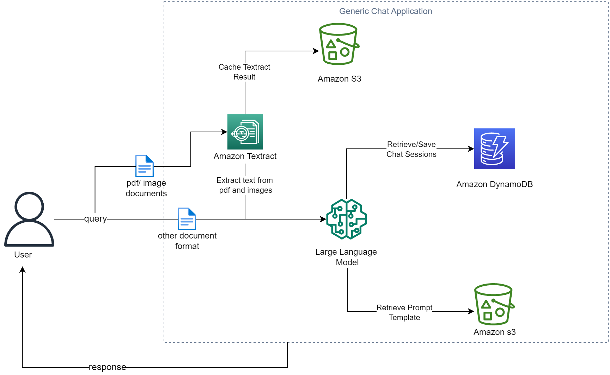
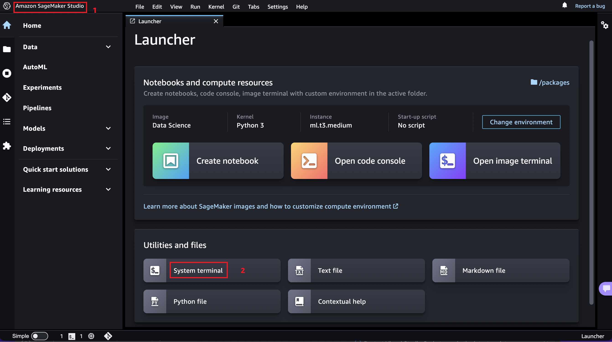

# ChatBot

This sample notebooks implements a general chatbot.
Key functionalities include:
1. Saving of Conversation History in DynamoDB
2. Handling Document upload for various supported document format (PDF, JPG, CSV, EXCEL, PNG, TXT, JSON) by passing the document local or S3 path.
3. Implementing various prompt template store locally (can also be stored in S3)

There are two files of interest.
1. A Jupyter Notebook that walks you through the ChatBot Implementation.
2. A Streamlit app that can be deploy to create a UI Chatbot.

Begin with the **BedrockChatUI** notebook to create the DynamoDB Table and test the implementation. 

To Deploy the streamlit app:
1. Run the notebook to deploy a DynamoDB Table
2. Edit the config json file with your DynamoDB table name, a user id and an S3 bucket name for caching content.

To run this Streamlit App on Sagemaker Studio follow the steps in the link below:
If You have a sagemaker Studio Domain already set up, ignore the first item, however, item 2 is required.
* [Set Up SageMaker Studio](https://docs.aws.amazon.com/sagemaker/latest/dg/onboard-quick-start.html) 
* SageMaker execution role should have access to interact with [Bedrock](https://docs.aws.amazon.com/bedrock/latest/userguide/api-setup.html), [Textract](https://docs.aws.amazon.com/aws-managed-policy/latest/reference/AmazonTextractFullAccess.html), [DynamoDB] (https://docs.aws.amazon.com/amazondynamodb/latest/developerguide/iam-policy-specific-table-indexes.html), and [S3](https://docs.aws.amazon.com/AmazonS3/latest/userguide/access-policy-language-overview.html).
* [Launch SageMaker Studio](https://docs.aws.amazon.com/sagemaker/latest/dg/studio-launch.html)
* [Clone this git repo into studio](https://docs.aws.amazon.com/sagemaker/latest/dg/studio-tasks-git.html)
* Open a system terminal by clicking on **Amazon SageMaker Studio** and then **System Terminal** as shown in the diagram below
* 
* Navigate into the cloned repository directory using the `cd` command and run the command `pip install -r req.txt` to install the needed python libraries
* Run command `python3 -m streamlit run bedrock-chat.py --server.enableXsrfProtection false --server.enableCORS  false` to start the Streamlit server. Do not use the links generated by the command as they won't work in studio.
* To enter the Streamlit app, open and run the cell in the **StreamlitLink.ipynb** notebook. This will generate the appropiate link to enter your Streamlit app from SageMaker studio. Click on the link to enter your Streamlit app.
* **⚠ Note:**  If you rerun the Streamlit server it may use a different port. Take not of the port used (port number is the last 4 digit number after the last : (colon)) and modify the `port` variable in the `StreamlitLink.ipynb` notebook to get the correct link.

To run this Streamlit App on AWS EC2 (I tested this on the Ubuntu Image)
* [Create a new ec2 instance](https://docs.aws.amazon.com/AWSEC2/latest/UserGuide/EC2_GetStarted.html)
* Expose TCP port range 8500-8510 on Inbound connections of the attached Security group to the ec2 instance. TCP port 8501 is needed for Streamlit to work. See image below
* 
* [Connect to your ec2 instance](https://docs.aws.amazon.com/AWSEC2/latest/UserGuide/AccessingInstances.html)
* Run the appropiate commands to update the ec2 instance (`sudo apt update` and `sudo apt upgrade` -for Ubuntu)
* Clone this git repo `git clone [github_link]`
* Install python3 and pip if not already installed
* EC2 [instance profile role](https://docs.aws.amazon.com/IAM/latest/UserGuide/id_roles_use_switch-role-ec2_instance-profiles.html) has the required permissions to access the services used by this application mentioned above.
* Install the dependencies in the requirements.txt file by running the command `sudo pip install -r req.txt`
* Run command `python3 -m streamlit run bedrock-chat.py
* Copy the external link and paste in a new browser tab
